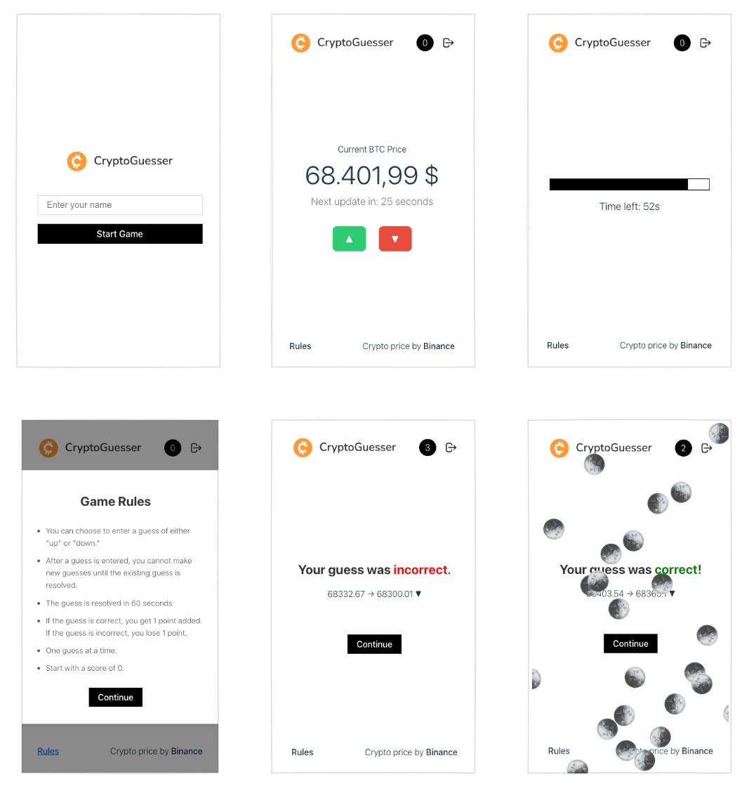
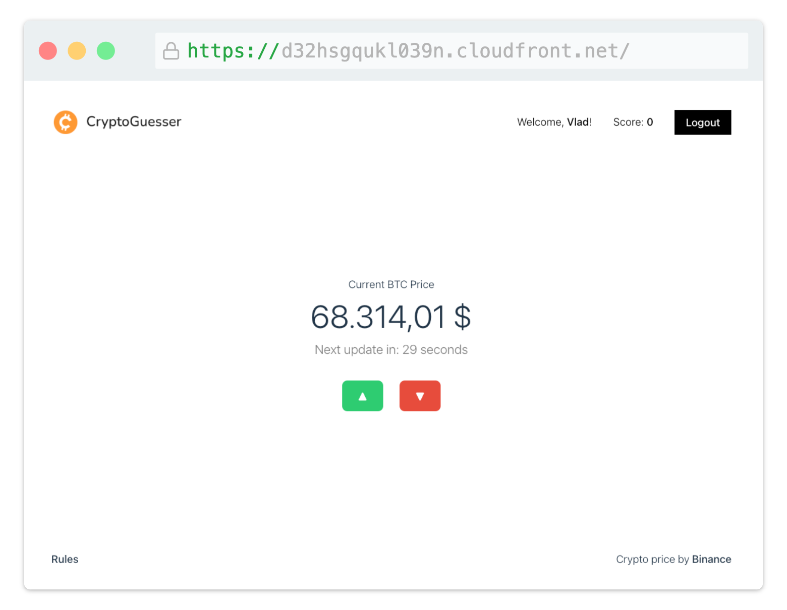
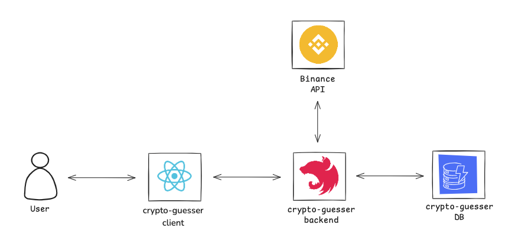
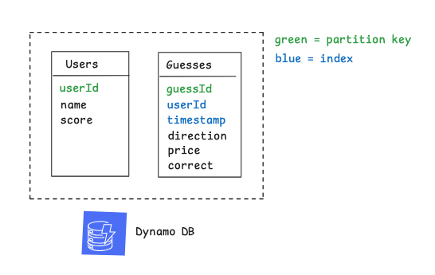
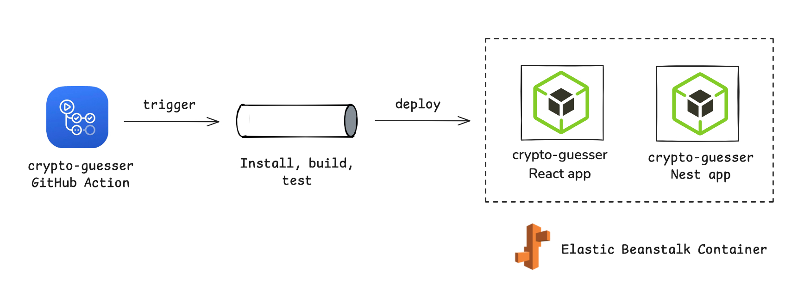

<div align="center">
  <br/>
  <br/>
  
  <br/>
  <br/>
  <p align="center">
    Guess BTC next move!
  </p>
  <br/>
  <br/>
</div>

## Screenshots

Mobile



Desktop




## Architecture overview

A web app where users guess if Bitcoin's price will go higher or lower after one minute, with real-time updates and score tracking, backed by AWS.

The user is interacting with React frontend that sends and receives data via REST API provided by NestJS backend. The backend communicates with the Binance API to retrieve real-time Bitcoin price data and with AWS DynamoDB to store and manage game-related data, such as guesses and scores.



## Prerequisites

### Needed tools

- Node: v20.14.0 (_recommended_)
- NPM: 10.8.2 (_recommended_)
- Playwright (run `npx playwright install`)

### AWS Setup

#### Option 1

Set environment variables in `server/.env`file:

```bash    
AWS_ACCESS_KEY_ID=
AWS_SECRET_ACCESS_KEY=
AWS_REGION=eu-central-1
API_KEY=
```

where `API_KEY` is a secret key that will be used to authenticate requests to the backend. The value can be generate using [Random key generator](https://generate-random.org/api-key-generator), for example.

🚨 Please reach out to me if you would like me to setup an AWS account for you.

#### Option 2

Setup the following in DynamoDB:

- `Users` table with `userId` as the primary key
- `Guesses` table with `guessId` as the primary key
- `UserIdIndex` index on `Guesses` table with `userId` as the partition key and `timestamp` as the sort key.
- IAM user with `AmazonDynamoDBFullAccess` policy attached



## Run Locally

Clone the project

```bash
git clone https://github.com/zaikinv/crypto-guesser.git
```

Go to the project directory

```bash
cd crypto-guesser
```

Install dependencies

```bash
cd client && npm i && cd ../server && npm i && cd ..
```

Start client & server

```bash
cd client && npm run start & cd ../server && npm run start
```

...wait for client & server to startup, then open `http://localhost:5173/` (or URL indicated in your terminal in case port `5173` is in use) in your browser.

🚨 Depending on your local port availability, you may need to adjust the `apiBaseUrl` in the `client/src/config.ts` file. See [Configuration](#configuration) section for more details.

## API Documentation (Swagger)

https://d32hsgqukl039n.cloudfront.net/api-docs

or `http://localhost:5173/api-docs` if running locally.

## Configuration

### Frontend

See the `client/src/config.ts` file for the application configuration.

```javascript
const appConfig = {
  apiBaseUrl: 'http://localhost:8080/api',
  priceChangeTimeout: 30000,
  guessTimeout: 60
}
```

### Backend

See the `server/src/config.ts` file for the application configuration.

```javascript
const appConfig = {
  priceApiBaseUrl: 'https://api.binance.com/api/v3',
  guessTimeout: 60,
  symbol: 'BTCUSDT',
}
```

## Deployment

[Deploy on AWS](https://github.com/zaikinv/crypto-guesser/actions/workflows/main.yml)

The GitHub Action has to be manually triggered. The pipeline is installing dependencies, building the codeand running the tests. Once the build process is complete, the pipeline deploys both the React frontend and NestJS backend as containerized applications into an Elastic Beanstalk environment.



## Unit Tests

### Unit

#### Frontend

```bash
cd client && npm run test:unit
```

#### Backend

```bash
cd server && npm run test:unit
```

### E2E

#### Frontend

🚨 Make sure the backend is running before running E2E tests and if not, run `cd server && npm run start` first.

```bash
cd client && npm run test:e2e
```

You can also run E2E tests in Playwright UI by running `cd client && npm run test:e2e-ui`.

#### Backend

```bash
cd server && npm run test:e2e
```

### Known limitations

- After 60 seconds the price might not change, which will result in a draw (logic: the guess can be either UP or DOWN, but in this case it is neither UP nor DOWN)
- Unit and E2E tests are not covering all the codebase, but only the most critical parts
- E2E tests are intentionally excluded from the pipeline due to the time & resources constraints and still can be run locally
- Nest build doesn't work well within npm workspace and requires an own standalone package unless Nest custom [monorepo](https://docs.nestjs.com/cli/monorepo) is used.
